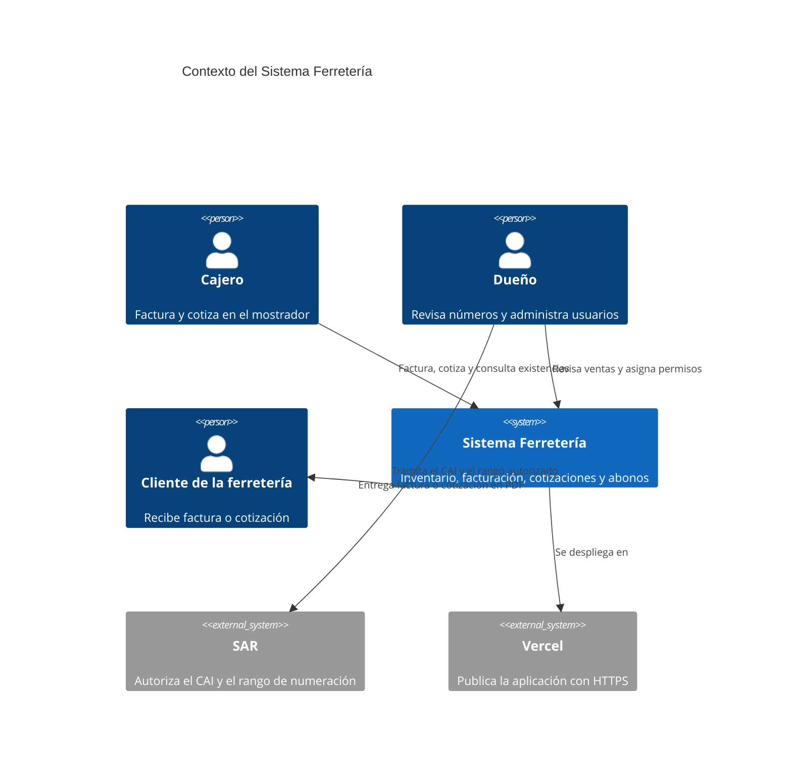
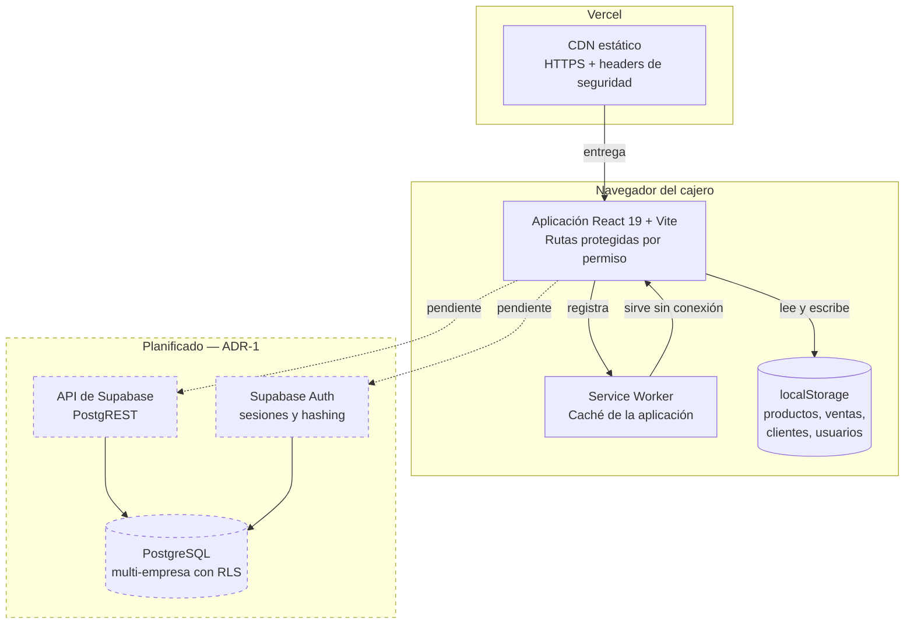
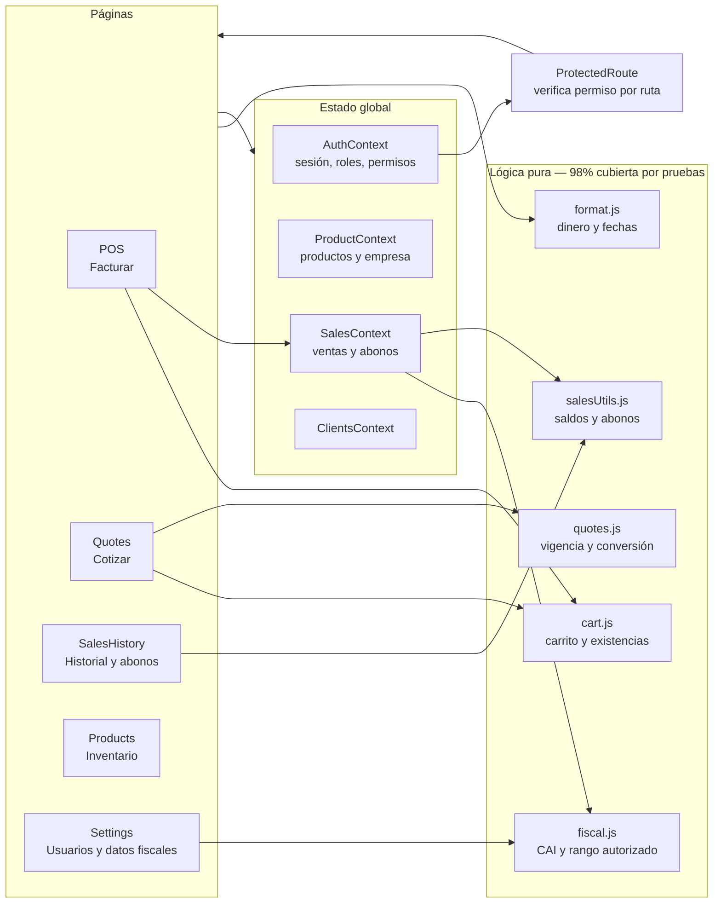

# Arquitectura — Sistema Ferretería

Código de verificación: `LEARN-CAP-50768C03`

Producto publicado: https://www.oviedoarnold.lat/
Repositorio: https://github.com/oviedoarnold/Sistema-Ferreteria

---

## 1. El problema que resuelve

Una ferretería de mostrador lleva el inventario en cuadernos o en hojas de cálculo
sueltas. Nadie sabe con certeza qué queda en bodega hasta que un cliente lo pide.
Las ventas al crédito se anotan aparte y los abonos se pierden. Al cierre del mes
no hay forma rápida de saber cuánto se vendió ni cuánto deben.

El sistema reúne inventario, facturación, cotizaciones, abonos y clientes en una
sola aplicación, con control de acceso por sección para que el dueño decida qué ve
cada empleado.

---

## 2. Diagrama C4 — Nivel 1: Contexto

## 3. Diagrama C4 — Nivel 2: Contenedores

El estado actual es una aplicación de una sola página que guarda todo en el
navegador. La migración a PostgreSQL está documentada en el ADR-1 y aparece
marcada como planificada.

## 4. Diagrama C4 — Nivel 3: Componentes del frontend

---

## 5. Decisiones de arquitectura

| ADR | Título | Estado |
|---|---|---|
| [ADR-1](adr/adr-001-postgresql-multiempresa.md) | PostgreSQL multi-empresa con seguridad a nivel de fila | Aceptada |
| [ADR-2](adr/adr-002-permisos-por-ruta.md) | Control de acceso verificado en cada ruta, no solo en el menú | Aceptada e implementada |

---

## 6. Calidad

| Métrica | Valor |
|---|---|
| Pruebas automatizadas | 317 |
| Cobertura de líneas | 63,3 % |
| Avisos de ESLint | 0 |
| Integración continua | GitHub Actions, bloquea en lint, pruebas y build |

El pipeline está en [`.github/workflows/ci.yml`](../.github/workflows/ci.yml) y corre
en cada push a `main`.

### Qué se decidió no probar

`src/utils/documentUtils.js` genera los PDF con jsPDF y html2canvas. Probarlo en
jsdom verificaría que las funciones se ejecutan, no que el archivo resultante sea
correcto — eso se comprueba abriendo el PDF. Está excluido de la medición de
cobertura con esa justificación en [`vite.config.js`](../vite.config.js).

---

## 7. Seguridad

Los headers se declaran en [`vercel.json`](../vercel.json):

| Header | Protege contra |
|---|---|
| `Content-Security-Policy` | Inyección de scripts de terceros (XSS) |
| `X-Frame-Options: DENY` | Clickjacking mediante iframes |
| `X-Content-Type-Options: nosniff` | Ejecución de archivos con MIME adivinado |
| `Referrer-Policy` | Fuga de rutas privadas hacia sitios externos |
| `Permissions-Policy` | Acceso silencioso a cámara, micrófono y ubicación |

### Limitación conocida

Mientras la persistencia siga en `localStorage`, los datos y los permisos viven en
el navegador del cliente. El control de acceso actual **separa funciones entre
empleados de confianza; no contiene a quien quiera burlarlo** abriendo las
herramientas de desarrollo. Cerrar esa brecha es precisamente el objetivo del
ADR-1: mover los datos al servidor y que las políticas se apliquen en la base.
